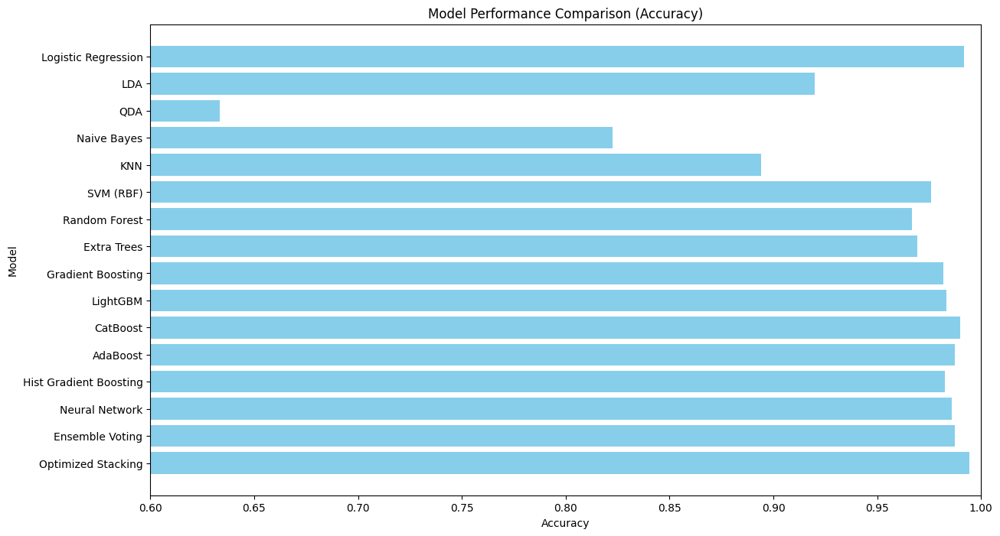
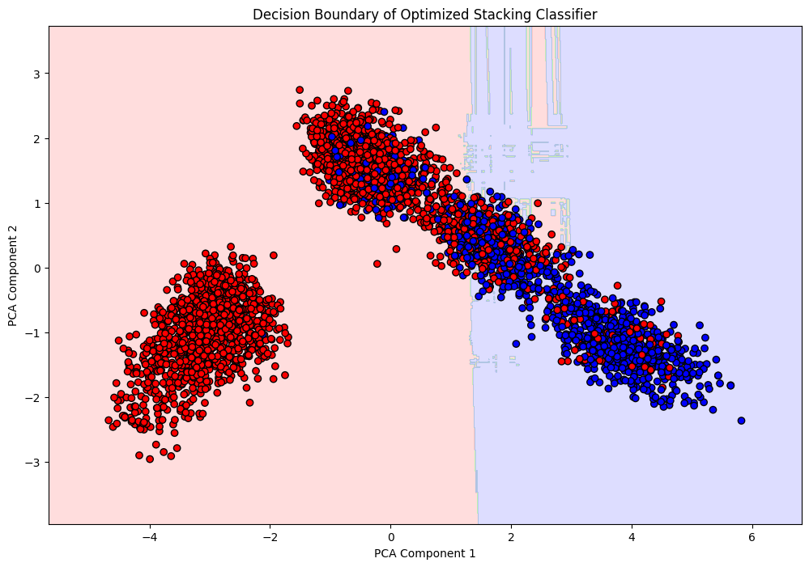

## **Health Prediction using Stacking Classifier** - [link](https://colab.research.google.com/drive/1jBgcT8CnDYgkbmyHQEKW1cCyOqyB2KwU?usp=sharing#scrollTo=8j33TmtHLk81)
made by Advait Dongre
An advanced machine learning project focused on predicting individual health status using various machine learning models and stacking techniques. The optimized stacking classifier outperforms traditional models with high accuracy and low loss, ensuring robust predictions.

### **Table of Contents**
- [Project Overview](#project-overview)  
- [Models Used](#models-used)  
- [Performance Summary](#performance-summary)  
- [Prerequisites](#prerequisites)  
- [Setup Instructions](#setup-instructions)  
- [Usage](#usage)  
- [Results Visualization](#results-visualization)  
- [Conclusion](#conclusion)

---

### **Project Overview**
The goal of this project is to develop a predictive model that accurately determines an individual's health status based on lifestyle and fitness features. The project involves feature engineering, hyperparameter tuning with Optuna, and the implementation of various machine learning models, culminating in an optimized stacking classifier.

---

### **Models which i looked tried**
Below is the list of machine learning models evaluated during this project, along with their respective performance metrics:

| Model                           | Accuracy  | Precision | Recall | F1 Score |
|---------------------------------|-----------|-----------|--------|----------|
| Logistic Regression              | 99.17%    | 99.24%    | 98.24% | 98.73%   |
| Linear Discriminant Analysis     | 92.00%    | 91.23%    | 83.88% | 87.40%   |
| Quadratic Discriminant Analysis  | 63.33%    | 47.43%    | 99.75% | 64.29%   |
| Naive Bayes                      | 82.25%    | 69.83%    | 81.61% | 75.26%   |
| K-Nearest Neighbors              | 89.42%    | 86.29%    | 80.86% | 83.49%   |
| SVM (RBF Kernel)                 | 97.58%    | 96.94%    | 95.72% | 96.32%   |
| Random Forest                    | 96.67%    | 96.36%    | 93.45% | 94.88%   |
| Extra Trees Classifier           | 96.92%    | 96.39%    | 94.21% | 95.29%   |
| Gradient Boosting                | 98.17%    | 97.95%    | 96.47% | 97.21%   |
| LightGBM                         | 98.33%    | 97.24%    | 97.73% | 97.49%   |
| CatBoost                         | 99.00%    | 98.98%    | 97.98% | 98.48%   |
| AdaBoost                         | 98.75%    | 99.23%    | 96.98% | 98.09%   |
| Histogram-Based Gradient Boosting| 98.25%    | 97.47%    | 97.23% | 97.35%   |
| Neural Network                   | 98.58%    | 97.50%    | 98.24% | 97.87%   |
| Ensemble Voting                  | 98.75%    | 98.23%    | 97.98% | 98.11%   |
| **Optimized Stacking Classifier**| **99.42%**| **99.36%**| **98.98%**| **99.17%**|

---

### **Performance Summary**
| Metric                         | Training Accuracy | Validation Accuracy | Test Accuracy |
|--------------------------------|------------------|--------------------|---------------|
| Optimized Stacking Classifier  | **99.58%**       | **99.33%**         | **99.42%**    |

---

### **Prerequisites**
Ensure you have the following installed:
- Python 3.8+  
- Jupyter Notebook  

---

### **Results Visualization**
The following images provide insights into the performance and decision boundary of the final model:

- **Model Performance Comparison**  
    

- **Decision Boundary Visualization**  
    

---

### **Conclusion**
This project demonstrates the power of ensemble learning using stacking classifiers for health prediction. With careful feature engineering, hyperparameter optimization, and stacking techniques, we achieved a **Test Accuracy of 99.42%**.  

The optimized stacking classifier leverages the strengths of individual models, ensuring robust and accurate predictions across different datasets.
